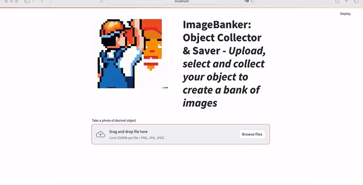

[](https://coveralls.io/github/MathisNcl/image-banker?branch=master)

[](https://github.com/MathisNcl/image-banker/actions/workflows/test.yaml)
[](https://github.com/MathisNcl/image-banker/actions/workflows/lint.yaml)

# ImageBanker: Object Collector & Saver


ImageBanker is a very simple web app for retrieving an object without background.
The main advantage is the ability to detect objects in the photo, so you do not need to take a standardized photo to crop an object - just select it from an old image, for example.

The implementation is not scratch-built: YoloV8 and rembg are used for detection and cropping.

## How do I use it?

Pretty straightforward! Go to the webapp, take a photo, choose the object you want to crop, then download the image if you are happy with the crop. Here is gif example of a use:



## Installation

For now, the webapp is not hosted online, you will have to install it by yourself on your laptop.

- Create a virtualenv and activate it, I use conda:

```shell
conda create -n my_env python=3.11 -y

conda activate my_env
```

- Git clone the repo and install it:

```shell
git clone https://github.com/MathisNcl/image-banker.git
cd image-banker
pip install -e .
```

- run app:

```shell
make app
# Wait for app to start, the first time is slower
```

Now your webapp is avaliable in your laptop at: <http://localhost:8501>.

For another device with same wifi at: <http://192.168.1.42:8501>!

Enjoy!🎉🎉

## Special thanks

Thanks to Louis Guichard and his nice [Pictify](https://github.com/louisguichard/pictify/tree/main) for the inspiration.

```bibtex
@software{yolov8_ultralytics,
  author = {Glenn Jocher and Ayush Chaurasia and Jing Qiu},
  title = {Ultralytics YOLOv8},
  version = {8.0.0},
  year = {2023},
  url = {<https://github.com/ultralytics/ultralytics}>,
  orcid = {0000-0001-5950-6979, 0000-0002-7603-6750, 0000-0003-3783-7069},
  license = {AGPL-3.0}
}
```

## ⚗️ Future features

- [ ] Add parameters to remove background
- [ ] Personnal implementation of removing background to remove huge memory dependancies
